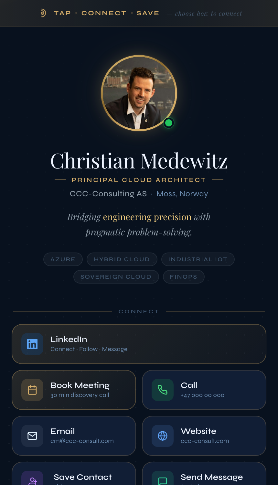
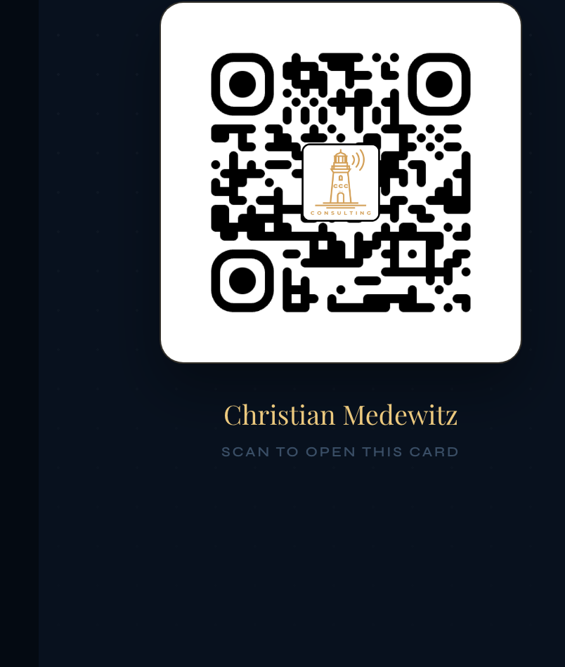

# Build your own NFC/QR digital business card

A personal digital business card — a single static web page, reachable by an
NFC (Near Field Communication) tap or a QR code, that works like a modern
replacement for a paper business card. This repo is a guide + AI prompt for
building your **own** version, with your own identity and your own design.

  
  

This isn't a template to fork and re-skin — it's a prompt designed to make
your AI coding assistant **ask you questions** about your own identity, your
own brand colors, and your own content, so what you end up with looks like
yours, not a copy of this one.

## How to use this repo

1. **[Prepare your assets](docs/01_PREPARE-YOUR-ASSETS.md)** — gather what
   you'll be asked for: a square profile photo (with the resolution that
   actually matters), your brand colors, fonts, and any content sources.
2. **[Copy the prompt](docs/02_PROMPT.md)** into your AI coding assistant of
   choice (Claude Code, ChatGPT, Cursor, etc.), and attach a screenshot of
   this card (the images above) as a structural reference. It'll interview
   you about your own version before writing any code.
3. **[Follow the setup guide](docs/03_SETUP-GUIDE.md)** for the parts no AI can
   click through for you — creating a GitHub account, a repository, and a
   free Azure Static Web App, plus a plain-language explanation of how the
   automated content-refresh workflows are wired up.
4. **New to any of this?** **[See the diagrams](docs/04_ARCHITECTURE.md)**
   first — a quick note on picking an editor, then five Mermaid diagrams
   walking through what actually happens between `git push` and your card
   being live, including how the automation and (optionally) secret-free
   Azure login work.
5. **[Read the lessons learned](docs/05_LESSONS-LEARNED.md)** — real bugs hit
   building the reference card (a silently-broken "Save Contact" button on
   iPhone, a photo that wouldn't show in Contacts, a stale RSS feed, and
   more), already baked into the prompt, but worth understanding.

## What you end up with

- A hero section: photo, name, title, tagline, topic pills.
- A "Save Contact" button that downloads a proper `.vcf` with your photo
  embedded — tested against the real-world quirks of iOS Contacts.
- Tap-to-act buttons for however people should reach you: call, email, SMS,
  book a meeting, your website, LinkedIn.
- Optional sections: a "latest content" feed from your blog, a "latest
  videos" feed from your YouTube channel, and a QR fallback screen for when
  NFC isn't an option.
- Zero backend, zero database, zero tracking — a static site with a couple
  of scheduled GitHub Actions workflows doing the only "dynamic" work.
- Deployed for free on Azure Static Web Apps.

## License

[MIT](LICENSE) — use this guide and prompt however you like.
