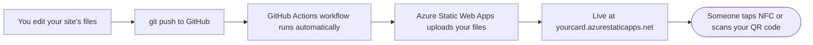
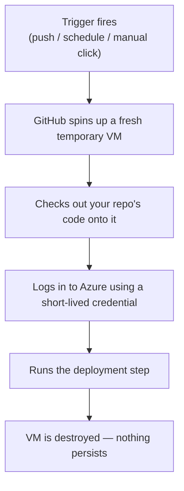
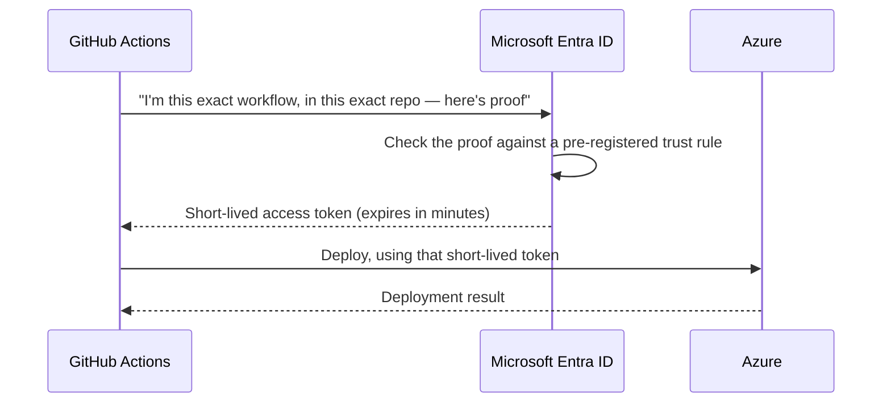
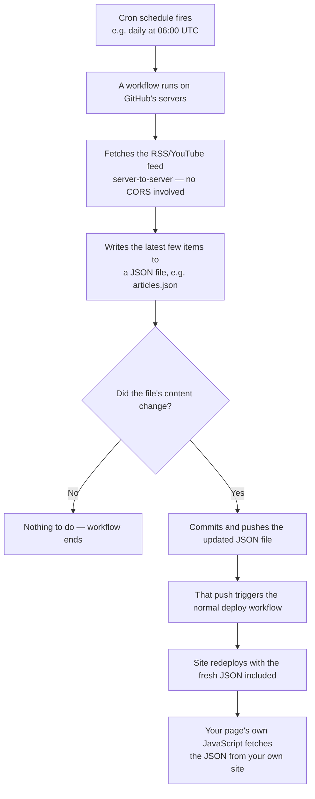
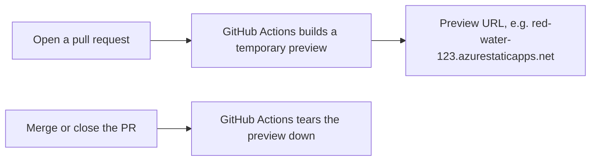

# How it all fits together

Four diagrams to make sense of GitHub, GitHub Actions, and Azure before you
dive into the [setup guide](03_SETUP-GUIDE.md). If you've never worked with any
of these, start at the top and work down.

## 1. The big picture: from your laptop to a live URL

- **GitHub** just stores your code and its history — nothing runs there by
  itself.
- **GitHub Actions** is GitHub's automation layer: it watches your repo for
  events (a push, a schedule, a manual click) and runs scripts in response.
  Each script is a **workflow**, defined as a YAML file in
  `.github/workflows/`.
- **Azure Static Web Apps** is where your site actually lives on the
  internet. It doesn't know or care about GitHub directly — the workflow is
  what uploads your files to it.

## 2. What happens inside a workflow run

Every workflow run starts from a completely clean machine, does its job,
and throws the machine away afterward. Nothing about your workflow run is
kept around between runs except what you explicitly commit back to the
repo (like a refreshed `articles.json`).

## 3. How GitHub Actions authenticates to Azure — the advanced path

The **easy path** in the [setup guide](03_SETUP-GUIDE.md) has Azure generate a
deployment secret for you automatically, stored in GitHub as an encrypted
repo secret. That's fine, and simplest to start with.

The **advanced path** — what the reference build actually uses — skips
storing any secret at all, using OpenID Connect (OIDC) federated
credentials instead:

Nothing long-lived is ever stored in GitHub — the "proof" is generated
fresh by GitHub for each run and is only valid for that run, from that
exact workflow, in that exact repo. If you want this path, tell your AI
assistant "set this up with OIDC instead of a stored deployment token" and
it can walk you through registering the trust rule in Azure (an "App
Registration" with a "federated credential").

## 4. How the content-refresh automation works

If your card has a "latest articles" or "latest videos" section, this loop
runs independently of the main deploy workflow:

The key idea: your browser never talks to the external feed directly. A
scheduled job does that on your behalf, from a context where cross-origin
restrictions don't apply, and hands your page a plain same-origin file
instead.

## 5. Bonus: pull request preview environments

A nice Azure Static Web Apps feature, if you ever collaborate with someone
or just want to review a change before it goes live:

Each open PR gets its own throwaway URL to review changes on, separate
from your live site, cleaned up automatically once you're done with it.

---

Ready to build? Head back to **[the setup guide](03_SETUP-GUIDE.md)**.
